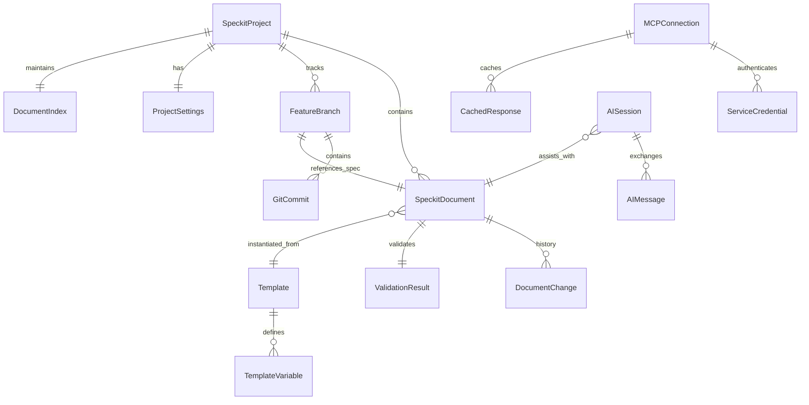

# Data Model: Speckit Editor

**Feature**: 001-speckit-editor-ide | **Phase**: 1 (Design) | **Date**: 2025-12-22

## Purpose

Define core domain entities, relationships, and data structures for the Speckit Document Editor. This model supports document editing, project navigation, git operations, MCP service integration, AI assistance, and template management.

---

## Entity Relationship Diagram



---

## Core Entities

### 1. SpeckitProject

Represents the root project containing all speckit documents and git repository.

**Attributes**:
```python
@dataclass
class SpeckitProject:
    root_path: Path                          # Absolute path to project root
    name: str                                # Project name (derived from root directory)
    constitution_path: Optional[Path]        # Path to .specify/memory/constitution.md
    documents: Dict[Path, SpeckitDocument]   # Cached documents (lazy loaded)
    branches: Dict[str, FeatureBranch]       # Feature branches (key = branch name)
    current_branch: str                      # Active git branch name
    settings: ProjectSettings                # Project-specific settings
    index: DocumentIndex                     # Search index
    git_repo: pygit2.Repository              # Git repository handle
    
    created_at: datetime
    last_opened_at: datetime
```

**Behaviors**:
```python
def scan_documents(self) -> List[Path]:
    """Enumerate all .md files (lazy, no content loading)"""
    
def get_document(self, path: Path) -> SpeckitDocument:
    """Load document on-demand (with caching)"""
    
def create_feature_branch(self, feature_id: str, description: str) -> FeatureBranch:
    """Create new feature branch from current HEAD"""
    
def validate_structure(self) -> ValidationResult:
    """Validate project follows speckit conventions"""
    
def rebuild_index(self, background: bool = True) -> None:
    """Rebuild search index (optionally in background thread)"""
```

**Validation Rules**:
- Root path must contain `.specify/` directory
- Constitution must exist at `.specify/memory/constitution.md`
- Must be valid git repository
- Feature branches must follow `###-feature-name` naming pattern

**Storage**: Metadata cached in `.specify/cache/project.json`

---

### 2. SpeckitDocument

Represents a single markdown document (spec, plan, task, constitution, etc.).

**Attributes**:
```python
@dataclass
class SpeckitDocument:
    path: Path                               # Absolute path to file
    relative_path: Path                      # Path relative to project root
    content: str                             # Raw markdown content
    document_type: DocumentType              # spec | plan | tasks | constitution | checklist | other
    
    # Parsed structure (cached)
    frontmatter: Optional[Dict[str, Any]]    # YAML frontmatter if present
    sections: List[Section]                  # Hierarchical section tree
    requirements: List[Requirement]          # FR-XXX, SC-XXX, CHK-XXX items
    
    # Metadata
    feature_id: Optional[str]                # Feature ID if spec/plan/tasks (e.g., "001")
    template_source: Optional[str]           # Template name if instantiated from template
    
    # State tracking
    is_dirty: bool                           # Has unsaved changes
    last_saved_at: datetime
    last_modified_at: datetime
    change_history: List[DocumentChange]     # Undo/redo stack
    
    # Validation
    validation_result: Optional[ValidationResult]

class DocumentType(Enum):
    SPEC = "spec"
    PLAN = "plan"
    TASKS = "tasks"
    CONSTITUTION = "constitution"
    CHECKLIST = "checklist"
    RESEARCH = "research"
    DATA_MODEL = "data-model"
    QUICKSTART = "quickstart"
    OTHER = "other"

@dataclass
class Section:
    level: int                               # Heading level (1-6)
    title: str                               # Heading text
    content: str                             # Section content (excluding subsections)
    line_start: int                          # Starting line number
    line_end: int                            # Ending line number
    subsections: List[Section]               # Nested sections

@dataclass
class Requirement:
    id: str                                  # e.g., "FR-001", "SC-005", "CHK-042"
    type: RequirementType                    # FR | SC | CHK
    text: str                                # Requirement description
    line_number: int                         # Line in document
    priority: Optional[str]                  # P1 | P2 | P3 | P4 (if applicable)
    status: Optional[str]                    # For CHK items: checked | unchecked
    references: List[str]                    # Cross-references to other requirements

class RequirementType(Enum):
    FUNCTIONAL = "FR"
    SUCCESS_CRITERIA = "SC"
    CHECKLIST = "CHK"
    TASK = "TSK"
```

**Behaviors**:
```python
def parse(self) -> None:
    """Parse markdown into structured sections and requirements"""
    
def validate(self) -> ValidationResult:
    """Validate document structure and requirement IDs"""
    
def apply_change(self, change: DocumentChange) -> None:
    """Apply edit and update change history (for undo/redo)"""
    
def save(self) -> None:
    """Write content to disk and update metadata"""
    
def get_requirement(self, req_id: str) -> Optional[Requirement]:
    """Lookup requirement by ID"""
    
def get_section(self, title: str) -> Optional[Section]:
    """Lookup section by title"""
```

**Validation Rules**:
- Requirement IDs must be unique within document
- Requirement IDs must follow pattern: `(FR|SC|CHK|TSK)-\d{3}`
- Requirement numbering must be sequential (FR-001, FR-002, ...)
- Cross-references must point to existing requirements

**Storage**: Files on disk; parsed structure cached in memory

---

### 3. FeatureBranch

Represents a git feature branch tied to a speckit feature.

**Attributes**:
```python
@dataclass
class FeatureBranch:
    name: str                                # Branch name (e.g., "001-editor-ide")
    feature_id: str                          # Feature ID (e.g., "001")
    description: str                         # Feature description
    spec_path: Optional[Path]                # Path to feature spec.md
    plan_path: Optional[Path]                # Path to feature plan.md
    tasks_path: Optional[Path]               # Path to feature tasks.md
    
    # Git metadata
    head_commit: str                         # SHA of HEAD commit
    base_branch: str                         # Branch created from (usually "main")
    commits: List[GitCommit]                 # Commit history
    
    # Status
    is_current: bool                         # Currently checked out
    has_uncommitted_changes: bool            # Dirty working tree
    ahead_count: int                         # Commits ahead of base
    behind_count: int                        # Commits behind base
    
    created_at: datetime
    last_commit_at: datetime
```

**Behaviors**:
```python
def checkout(self) -> None:
    """Checkout this branch (git checkout)"""
    
def commit(self, message: str, files: List[Path]) -> GitCommit:
    """Create commit with conventional commit format"""
    
def push(self, remote: str = "origin") -> None:
    """Push branch to remote"""
    
def pull(self, remote: str = "origin") -> None:
    """Pull changes from remote"""
    
def merge_from(self, source_branch: str) -> MergeResult:
    """Merge another branch into this one"""
    
def get_diff(self, other_branch: Optional[str] = None) -> List[FileDiff]:
    """Get diff vs. another branch or uncommitted changes"""
```

**Validation Rules**:
- Branch name must match pattern: `\d{3}-[a-z0-9-]+`
- Feature ID must match branch name prefix
- Spec document must exist at `specs/{feature_id}/spec.md`

**Storage**: Git repository (refs/heads/); metadata derived from git

---

### 4. DocumentChange

Represents a single edit operation for undo/redo.

**Attributes**:
```python
@dataclass
class DocumentChange:
    change_id: str                           # Unique identifier (UUID)
    operation: ChangeOperation               # insert | delete | replace
    position: int                            # Character offset in document
    old_text: str                            # Text before change (for undo)
    new_text: str                            # Text after change (for redo)
    timestamp: datetime
    
class ChangeOperation(Enum):
    INSERT = "insert"
    DELETE = "delete"
    REPLACE = "replace"
```

**Behaviors**:
```python
def undo(self, document: SpeckitDocument) -> None:
    """Revert this change"""
    
def redo(self, document: SpeckitDocument) -> None:
    """Reapply this change"""
```

**Storage**: In-memory only (change history stack)

---

### 5. Template

Represents a reusable document template.

**Attributes**:
```python
@dataclass
class Template:
    name: str                                # Template name (e.g., "spec-template")
    path: Path                               # Path to template file
    description: str                         # Human-readable description
    template_type: TemplateType              # spec | plan | tasks | checklist | custom
    content: str                             # Template markdown with variables
    variables: List[TemplateVariable]        # Required variables
    
    created_at: datetime
    last_modified_at: datetime

class TemplateType(Enum):
    SPEC = "spec"
    PLAN = "plan"
    TASKS = "tasks"
    CHECKLIST = "checklist"
    CUSTOM = "custom"

@dataclass
class TemplateVariable:
    name: str                                # Variable name (e.g., "FEATURE_ID")
    description: str                         # Help text for user
    default_value: Optional[str]             # Default if not provided
    required: bool                           # Must be provided
    validation_pattern: Optional[str]        # Regex pattern for validation
```

**Standard Template Variables**:
- `[FEATURE_NAME]` - Name/description of the feature (required for spec, plan, tasks)
- `[FEATURE_ID]` - Feature number/identifier (e.g., "001", required for spec, plan, tasks)
- `[DATE]` - Current date in YYYY-MM-DD format (default: today)
- `[AUTHOR]` - Document author name (default: git user.name or OS username)
- `[BRANCH]` - Git branch name (default: current branch)
- `[TASK_NAME]` - Task description (required for task templates)
- `[TASK_ID]` - Task identifier (e.g., "T001", required for task templates)
- `[TASK_IMPLEMENTER]` - Person assigned to task (optional)
- `[FEATURE_IMPLEMENTER]` - Person assigned to feature (optional)
- `[DONE_DATE]` - Completion date in YYYY-MM-DD format (optional)

**Behaviors**:
```python
def instantiate(self, variables: Dict[str, str], output_path: Path) -> SpeckitDocument:
    """Replace variables and create new document"""
    
def validate_variables(self, variables: Dict[str, str]) -> ValidationResult:
    """Check all required variables provided and valid"""
    
def get_missing_variables(self, variables: Dict[str, str]) -> List[str]:
    """Return list of required variables not provided"""
```

**Validation Rules**:
- Variable names must match pattern: `[A-Z_]+`
- Variable placeholders in template: `[VARIABLE_NAME]`
- Required variables must be provided before instantiation

**Storage**: `.specify/templates/*.md`

---

### 6. MCPConnection

Represents connection to an MCP service.

**Attributes**:
```python
@dataclass
class MCPConnection:
    service_type: ServiceType                # jira | github | git | database | terminal | chrome
    name: str                                # User-defined connection name
    config: Dict[str, Any]                   # Service-specific configuration
    
    # Connection state
    is_connected: bool
    is_authenticated: bool
    last_connected_at: Optional[datetime]
    last_error: Optional[str]
    
    # Credentials
    credentials: List[ServiceCredential]
    
    # Caching
    cache: List[CachedResponse]

class ServiceType(Enum):
    JIRA = "jira"
    GITHUB = "github"
    GIT = "git"
    DATABASE = "database"
    TERMINAL = "terminal"
    CHROME = "chrome"

@dataclass
class ServiceCredential:
    credential_type: CredentialType          # token | username_password | ssh_key | oauth
    identifier: str                          # Credential identifier in OS keyring
    created_at: datetime
    expires_at: Optional[datetime]

class CredentialType(Enum):
    TOKEN = "token"
    USERNAME_PASSWORD = "username_password"
    SSH_KEY = "ssh_key"
    OAUTH = "oauth"

@dataclass
class CachedResponse:
    request_key: str                         # Hash of (service, method, args)
    response_data: Dict[str, Any]            # Cached response
    cached_at: datetime
    expires_at: Optional[datetime]
```

**Behaviors**:
```python
async def connect(self) -> bool:
    """Establish connection to MCP service"""
    
async def authenticate(self) -> bool:
    """Authenticate using stored credentials"""
    
async def call_method(self, method: str, **kwargs) -> Any:
    """Call service method (with caching)"""
    
def store_credential(self, credential: ServiceCredential) -> None:
    """Save credential to OS keyring"""
    
def load_credential(self, identifier: str) -> Optional[ServiceCredential]:
    """Retrieve credential from OS keyring"""
    
def cache_response(self, method: str, args: dict, response: dict) -> None:
    """Cache service response for offline access"""
    
def get_cached_response(self, method: str, args: dict) -> Optional[dict]:
    """Retrieve cached response"""
```

**Validation Rules**:
- Service config must include required fields (URL, project, etc.)
- Credentials must be encrypted before storage
- Cached responses must have expiration time

**Storage**: 
- Configuration: `.specify/cache/mcp_connections.json`
- Credentials: OS keyring (Windows Credential Manager, macOS Keychain, Linux Secret Service)
- Cache: `.specify/cache/mcp_cache.db` (SQLite)

---

### 7. AISession

Represents an AI-assisted editing session.

**Attributes**:
```python
@dataclass
class AISession:
    session_id: str                          # Unique identifier (UUID)
    document: SpeckitDocument                # Document being assisted
    session_type: AISessionType              # generation | inline_suggestion | chat
    
    # Conversation
    messages: List[AIMessage]                # User prompts and AI responses
    
    # State
    is_active: bool
    started_at: datetime
    last_interaction_at: datetime

class AISessionType(Enum):
    GENERATION = "generation"                # Generate full spec/plan/tasks
    INLINE_SUGGESTION = "inline_suggestion"  # Real-time code suggestions
    CHAT = "chat"                            # Conversational Q&A

@dataclass
class AIMessage:
    message_id: str                          # Unique identifier
    role: MessageRole                        # user | assistant | system
    content: str                             # Message content
    timestamp: datetime
    
    # For inline suggestions
    suggestion_text: Optional[str]           # Suggested text insertion
    suggestion_position: Optional[int]       # Character offset for insertion
    accepted: Optional[bool]                 # User accepted/rejected

class MessageRole(Enum):
    USER = "user"
    ASSISTANT = "assistant"
    SYSTEM = "system"
```

**Behaviors**:
```python
async def send_prompt(self, prompt: str) -> AIMessage:
    """Send user prompt to AI and get response"""
    
async def get_inline_suggestion(self, context: str, cursor_position: int) -> Optional[str]:
    """Get real-time suggestion based on current context"""
    
def accept_suggestion(self, message_id: str) -> None:
    """Accept AI suggestion and apply to document"""
    
def reject_suggestion(self, message_id: str) -> None:
    """Reject AI suggestion"""
    
def end_session(self) -> None:
    """Terminate AI session"""
```

**Validation Rules**:
- Session must be associated with a SpeckitDocument
- Messages must alternate user/assistant (except system messages)
- Inline suggestions must have valid cursor position

**Storage**: `.specify/cache/ai_sessions.db` (SQLite, for history/analytics)

---

### 8. DocumentIndex

Search index for fast document lookup.

**Attributes**:
```python
@dataclass
class DocumentIndex:
    index_path: Path                         # Path to SQLite database
    indexed_documents: Dict[Path, datetime]  # Document path -> last indexed time
    
    # In-memory inverted index
    word_index: Dict[str, Set[Path]]         # word -> document paths containing word
    requirement_index: Dict[str, Path]       # requirement ID -> document containing it
```

**Behaviors**:
```python
def index_document(self, document: SpeckitDocument) -> None:
    """Add/update document in index"""
    
def remove_document(self, path: Path) -> None:
    """Remove document from index"""
    
def search(self, query: str, case_sensitive: bool, regex: bool, scope: SearchScope) -> List[SearchResult]:
    """Search index for documents matching query"""
    
def find_requirement(self, req_id: str) -> Optional[Path]:
    """Locate document containing specific requirement"""
    
def rebuild(self, documents: List[SpeckitDocument], background: bool = True) -> None:
    """Rebuild entire index"""

class SearchScope(Enum):
    CURRENT_DOCUMENT = "current"
    OPEN_DOCUMENTS = "open"
    ALL_DOCUMENTS = "all"

@dataclass
class SearchResult:
    document_path: Path
    match_type: MatchType                    # filename | content | requirement_id
    line_number: Optional[int]               # Line number of match (if content match)
    context: str                             # Surrounding context (for content matches)
    
class MatchType(Enum):
    FILENAME = "filename"
    CONTENT = "content"
    REQUIREMENT_ID = "requirement_id"
```

**Validation Rules**:
- Index must be rebuilt when documents added/removed
- Incremental updates preferred over full rebuilds

**Storage**: `.specify/cache/index.db` (SQLite)

---

### 9. ProjectSettings

Project-specific configuration.

**Attributes**:
```python
@dataclass
class ProjectSettings:
    # Editor preferences
    tab_size: int = 4                        # Spaces per tab
    auto_save_enabled: bool = True
    auto_save_interval: int = 30             # Seconds (10-300 range)
    syntax_highlighting_enabled: bool = True
    
    # Git preferences
    git_auto_fetch: bool = False             # Auto-fetch from remote
    commit_message_template: str = ""        # Template for commit messages
    conventional_commits: bool = True        # Enforce conventional commit format
    
    # MCP preferences
    mcp_auto_connect: bool = False           # Auto-connect to services on startup
    mcp_connection_timeout: int = 10         # Seconds
    
    # AI preferences
    ai_inline_suggestions: bool = True       # Enable inline AI suggestions
    ai_auto_complete: bool = False           # Auto-accept high-confidence suggestions
    
    # Search preferences
    search_case_sensitive: bool = False
    search_regex_enabled: bool = False
    search_default_scope: SearchScope = SearchScope.CURRENT_DOCUMENT
    
    # Accessibility
    keyboard_navigation_enabled: bool = True
    screen_reader_mode: bool = False         # Optimizations for screen readers
    focus_indicators_enabled: bool = True
```

**Behaviors**:
```python
def save(self) -> None:
    """Persist settings to disk"""
    
def load(cls, project_root: Path) -> ProjectSettings:
    """Load settings from disk or create defaults"""
    
def reset_to_defaults(self) -> None:
    """Reset all settings to default values"""
```

**Validation Rules**:
- `auto_save_interval` must be between 10 and 300 seconds
- `mcp_connection_timeout` must be positive integer

**Storage**: `.specify/settings.json`

---

### 10. ValidationResult

Result of document or project validation.

**Attributes**:
```python
@dataclass
class ValidationResult:
    is_valid: bool
    errors: List[ValidationError]            # Blocking errors
    warnings: List[ValidationWarning]        # Non-blocking issues
    validated_at: datetime

@dataclass
class ValidationError:
    error_type: ErrorType
    message: str
    location: Optional[Location]             # File path + line number
    suggestion: Optional[str]                # How to fix

class ErrorType(Enum):
    DUPLICATE_REQUIREMENT_ID = "duplicate_requirement_id"
    INVALID_REQUIREMENT_ID = "invalid_requirement_id"
    BROKEN_REFERENCE = "broken_reference"
    MISSING_SECTION = "missing_section"
    INVALID_STRUCTURE = "invalid_structure"

@dataclass
class ValidationWarning:
    warning_type: WarningType
    message: str
    location: Optional[Location]

class WarningType(Enum):
    NON_SEQUENTIAL_IDS = "non_sequential_ids"
    UNUSED_TEMPLATE_VARIABLE = "unused_template_variable"
    LARGE_FILE = "large_file"

@dataclass
class Location:
    file_path: Path
    line_number: int
    column: Optional[int]
```

**Behaviors**:
```python
def format_errors(self) -> str:
    """Human-readable error summary"""
    
def has_blocking_errors(self) -> bool:
    """Check if validation failed with errors (vs. warnings only)"""
```

**Storage**: Transient (generated on-demand)

---

## Data Flow Examples

### Example 1: Create and Edit Document

```
User Action: New Document → Select Template → Fill Variables → Open Editor
└─> SpeckitProject.create_document_from_template(template, variables)
    └─> Template.instantiate(variables, output_path)
        └─> SpeckitDocument.parse()
            └─> SpeckitDocument.validate()
                └─> DocumentIndex.index_document(document)
                    └─> GUI: EditorWidget.load_document(document)
```

### Example 2: Search Across Project

```
User Action: Enter Search Query → Select Scope → Press Enter
└─> DocumentIndex.search(query, case_sensitive, regex, scope)
    └─> Returns List[SearchResult]
        └─> GUI: SearchResultsWidget.display(results)
            └─> User Click Result → EditorWidget.open_document(result.document_path, result.line_number)
```

### Example 3: Commit Changes

```
User Action: Stage Files → Enter Commit Message → Click Commit
└─> FeatureBranch.get_diff()
    └─> GUI: GitPanel.show_diff(diff)
        └─> User Confirm → FeatureBranch.commit(message, files)
            └─> pygit2.Repository.create_commit(...)
                └─> GitCommit created
                    └─> GUI: Update branch status
```

### Example 4: MCP Service Call (with Offline Cache)

```
User Action: Click "Fetch Jira Issues"
└─> MCPConnection.call_method("list_issues", project="PROJ")
    └─> Check online status
        ├─> Online: async call to MCP server
        │   └─> Cache response → Return data
        └─> Offline: MCPConnection.get_cached_response("list_issues", {"project": "PROJ"})
            └─> Return cached data with timestamp
                └─> GUI: Display with "Last updated: X hours ago" indicator
```

### Example 5: AI-Assisted Spec Generation

```
User Action: Click "Generate Spec" → Enter Prompt
└─> AISession.send_prompt("Generate spec for user authentication feature")
    └─> MCP Server → AI Service (via MCP)
        └─> AIMessage (assistant response with generated spec)
            └─> GUI: Preview generated content
                └─> User Accept → SpeckitDocument.apply_change(change)
                    └─> SpeckitDocument.save()
```

---

## State Transitions

### Document Lifecycle

```
[New] → [Editing] → [Dirty] → [Saving] → [Saved]
          ↓           ↓
       [Validating] [Reverting]
          ↓
       [Valid/Invalid]
```

### Branch Lifecycle

```
[Created] → [Current] → [Has Commits] → [Pushed] → [Merged]
             ↓              ↓
          [Stale]      [Conflicted]
```

### MCP Connection Lifecycle

```
[Configured] → [Connecting] → [Connected] → [Authenticated] → [Ready]
                   ↓              ↓              ↓
              [Failed]      [Disconnected]  [Expired] → [Re-authenticating]
```

---

## Performance Considerations

1. **Lazy Loading**: Documents loaded on-demand, not all upfront
2. **Caching**: Parsed document structures cached in memory
3. **Incremental Indexing**: Only re-index changed documents
4. **Background Operations**: Indexing, validation run in background threads
5. **Virtual Scrolling**: Tree views only render visible nodes
6. **Connection Pooling**: Reuse MCP connections across calls

---

## Security & Privacy

1. **Credential Storage**: OS keyring with AES-256 encryption
2. **Cache Encryption**: SQLite databases encrypted at rest
3. **Secure Communication**: HTTPS for all MCP service calls
4. **No Telemetry**: No usage data transmitted to external servers
5. **Audit Logging**: Track all MCP service calls with timestamps

---

## Migration & Versioning

**Data Model Version**: `1.0.0`

**Upgrade Path**: When data model changes in future versions:
1. Detect old version via `.specify/version.json`
2. Run migration script (`.specify/scripts/migrate-*.py`)
3. Backup old data to `.specify/backups/`
4. Apply transformations to new schema
5. Update version marker

**Backward Compatibility**: Maintain read support for N-1 version (e.g., v2.0 can read v1.0 data)

---

## Open Questions

None. Data model finalized. Proceed to contracts/ and quickstart.md.
